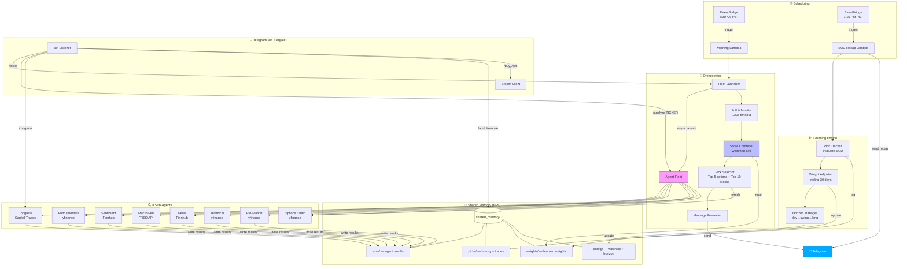
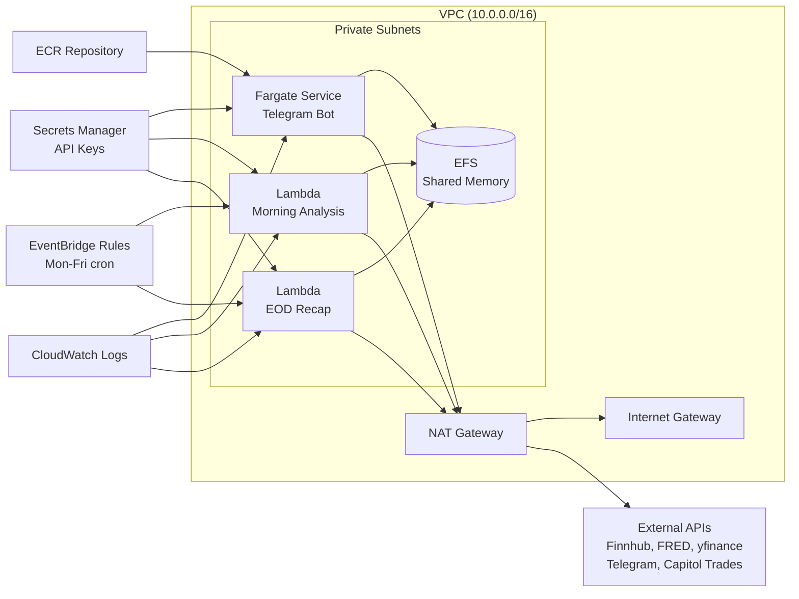

# 🦀 OpenClaw Market Intel

Multi-agent market intelligence system that analyzes 36 tickers across 8 dimensions and delivers actionable stock + options picks via Telegram every morning.

## Architecture



## Scoring System

Each agent scores every ticker on a 0-10 scale (5.0 = neutral). The orchestrator combines them using self-adjusting weights:

| Agent | Weight | Data Source | What It Measures |
|-------|--------|-------------|-----------------|
| Fundamentals | 18% | yfinance | PE, earnings growth, revenue, analyst targets |
| Sentiment | 15% | Finnhub | Reddit/Twitter buzz, analyst buy/sell ratios |
| Technical | 15% | yfinance | RSI, SMA crossovers, volume trends |
| News | 15% | Finnhub | Headline keyword sentiment (trailing 3 days) |
| Congress | 15% | Capitol Trades | Politician stock trades (STOCK Act filings) |
| Pre-Market | 12% | yfinance | Futures, global indices, pre-market gaps |
| Macro/Fed | 10% | FRED API | 10Y yield, VIX, Fed funds, CPI, unemployment |

**Composite Score → Action:**
- 8-10: Strong BUY/CALL 🟢
- 6-8: Moderate BUY 🟢
- 4-6: HOLD/WATCH 🟡
- 2-4: SELL/PUT 🔴
- 0-2: Strong SHORT 🔴

## Quick Start (Local)

### Prerequisites
- Python 3.10+
- Free API keys: [Finnhub](https://finnhub.io), [FRED](https://fred.stlouisfed.org/docs/api/api_key.html)

### Install

```bash
# 1. Clone
git clone https://github.com/ramuponugumati/openclaw-market-intel.git
cd openclaw-market-intel

# 2. Create virtual environment
python -m venv .venv
source .venv/bin/activate

# 3. Install dependencies
pip install -r requirements.txt

# 4. Configure API keys
cp .env.example .env
# Edit .env and add your FINNHUB_API_KEY and FRED_API_KEY

# 5. Run morning analysis
python run_morning.py
```

That's it. You'll see the full analysis output with Top 5 options + Top 10 stock picks.

### Run Tests

```bash
python -m pytest tests/ -v
```

### Telegram Bot (Optional)

```bash
# 1. Create a bot via @BotFather on Telegram, get the token
# 2. Get your user ID via @userinfobot on Telegram
# 3. Add to .env:
#    TELEGRAM_BOT_TOKEN=your_token
#    ALLOWED_USER_IDS=your_user_id

# 4. Start the bot
python -m telegram_bot.run_bot
```

Commands: `/picks`, `/analyze NVDA`, `/congress`, `/add TICKER`, `/remove TICKER`, `/help`


## Deploy to AWS

### Architecture on AWS



### Deploy Steps

```bash
# 1. Deploy CloudFormation stack
aws cloudformation deploy \
  --template-file infra/cloudformation.yaml \
  --stack-name openclaw-market-intel \
  --capabilities CAPABILITY_NAMED_IAM \
  --parameter-overrides \
    FinnhubApiKey=YOUR_KEY \
    FredApiKey=YOUR_KEY \
    TelegramBotToken=YOUR_TOKEN \
    TelegramChatId=YOUR_CHAT_ID \
    AllowedUserIds=YOUR_USER_ID

# 2. Build and push Docker image
ECR_URI=$(aws cloudformation describe-stacks \
  --stack-name openclaw-market-intel \
  --query 'Stacks[0].Outputs[?OutputKey==`EcrRepositoryUri`].OutputValue' \
  --output text)

aws ecr get-login-password | docker login --username AWS --password-stdin $ECR_URI
docker build -t openclaw-market-intel .
docker tag openclaw-market-intel:latest $ECR_URI:latest
docker push $ECR_URI:latest

# 3. Update Fargate service to pull new image
aws ecs update-service \
  --cluster openclaw-market-intel-cluster \
  --service openclaw-market-intel-service \
  --force-new-deployment
```

### Estimated AWS Cost

| Resource | Monthly Cost |
|----------|-------------|
| Fargate (256 CPU, 512 MB, 24/7) | ~$9 |
| Lambda (2 invocations/day, 5 min each) | ~$0.10 |
| EFS (< 1 GB) | ~$0.30 |
| NAT Gateway | ~$32 |
| **Total** | **~$42/month** |

💡 To reduce cost: run the Telegram bot on a $5/month VPS instead of Fargate, and skip the NAT Gateway by using Lambda with public subnets.

## Project Structure

```
openclaw-market-intel/
├── agents/                          # 9 OpenClaw agents
│   ├── orchestrator/skills/         # Fleet launcher, score combiner, pick selector, formatter
│   ├── fundamentals/skills/         # PE, earnings, analyst targets (yfinance)
│   ├── sentiment/skills/            # Social sentiment, analyst recs (Finnhub)
│   ├── macro/skills/                # Treasury yields, VIX, CPI (FRED)
│   ├── news/skills/                 # Headline sentiment (Finnhub)
│   ├── technical/skills/            # RSI, SMA, volume (yfinance)
│   ├── premarket/skills/            # Futures, global indices (yfinance)
│   ├── congress/skills/             # Politician trades (Capitol Trades)
│   └── options_chain/skills/        # Contract ranking (yfinance)
├── broker/                          # Alpaca client + order manager
├── telegram_bot/                    # Bot listener, auth, command router
├── lambda_handlers/                 # Morning analysis + EOD recap Lambdas
├── shared_memory/                   # EFS-mounted shared state
│   ├── config/watchlist.json        # 36-ticker watchlist by sector
│   ├── config/horizon_state.json    # Trading mode state machine
│   ├── weights/learned_weights.json # Self-adjusting agent weights
│   ├── runs/                        # Per-run agent result files
│   └── picks/                       # Pick history + trade log
├── infra/cloudformation.yaml        # Full AWS infrastructure
├── Dockerfile                       # Fargate container
├── config.py                        # Credential validation
├── tracker.py                       # Pick logging + EOD evaluation
├── weight_adjuster.py               # Learning engine
├── horizon_manager.py               # day_trade → swing_trade → long_term
├── run_morning.py                   # Local morning analysis runner
├── smoke_test.py                    # Quick 3-ticker test
└── tests/                           # 381 unit + integration tests
```

## Watchlist (36 Tickers)

| Sector | Tickers |
|--------|---------|
| Big Tech | AAPL, MSFT, NVDA, GOOGL, AMZN, META, TSLA |
| Semiconductors | AMD, AVGO, INTC, QCOM, MU, MRVL |
| Software/Cloud | CRM, NFLX, ORCL, PLTR, SNOW, SHOP |
| Fintech/Crypto | COIN, SOFI, SQ, HOOD |
| Healthcare | LLY, UNH, MRNA |
| Energy | XOM, CVX |
| Consumer | NKE, SBUX, DIS |
| ETFs | SPY, QQQ, IWM, DIA, ARKK |

## License

Private — not for redistribution.
