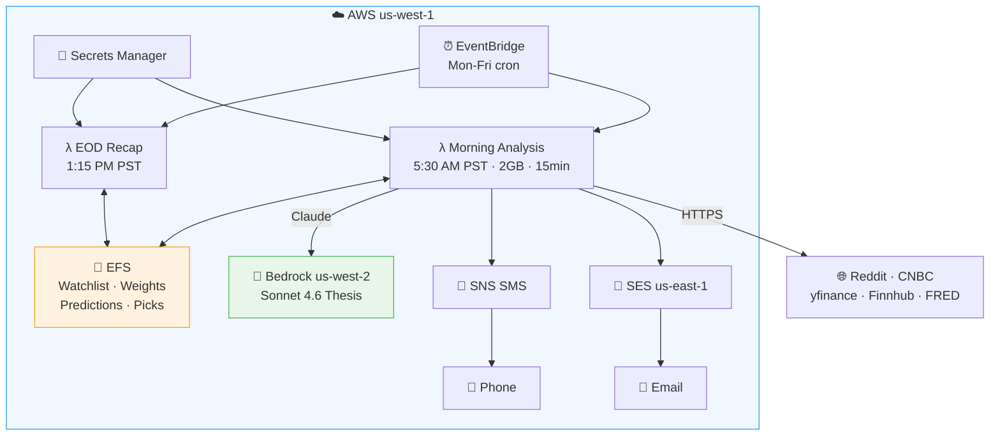

# 🦀 OpenClaw Market Intel

Multi-agent market intelligence system that analyzes 170+ tickers across 8 dimensions, scrapes Reddit (WSB, r/investing, r/stocks) + CNBC for sentiment, generates Claude AI theses via Bedrock, and delivers actionable picks via SMS + HTML email every morning.

## Architecture

```mermaid
flowchart LR
    subgraph DATA["🌐 Data Sources"]
        direction TB
        D1["📊 yfinance
        Price · Volume · Options"]
        D2["📰 Finnhub
        News · Sentiment"]
        D3["🏛️ FRED
        Yields · VIX · CPI"]
        D4["🏛️ Capitol Trades
        Congress Trading"]
        D5["🤖 Reddit
        WSB · Investing · Stocks"]
        D6["📺 CNBC · MarketWatch
        RSS Headlines"]
        D7["📈 Daily Movers
        S&P 500 Scanner"]
    end

    DATA --> AGENTS

    subgraph AGENTS["🔍 8 Analysis Agents"]
        direction TB
        A1["Pre-Market 25%
        Futures · Regime · Trends"]
        A2["Macro 20%
        VIX · Yields · Fed"]
        A3["Technical 20%
        RSI · SMA · Candles"]
        A4["News 12%
        Reddit + CNBC + Finnhub"]
        A5["Sentiment 8%
        Social Buzz · Analysts"]
        A6["Fundamentals 8%
        PE · Earnings (cap 8.0)"]
        A7["Congress 7%
        Politician Trades"]
        A8["Options Chain
        Contract Selection"]
    end

    AGENTS --> ORCH

    subgraph ORCH["🧠 Orchestrator"]
        direction TB
        O1["Score Combiner
        Weighted Composite"]
        O2["Pick Selector
        Top 8 Options + Top 20 Stocks"]
        O3["🤖 Claude Thesis
        Bedrock Sonnet 4.6"]
    end

    ORCH --> DELIVER

    subgraph DELIVER["📬 Delivery"]
        direction TB
        DEL1["📱 SMS via SNS"]
        DEL2["📧 HTML Email via SES"]
        DEL3["💬 Telegram Bot"]
    end

    ORCH --> LEARN

    subgraph LEARN["📈 Learning Loop"]
        direction TB
        L1["Prediction Tracker
        Save → Compare → Score"]
        L2["Weight Adjuster
        Auto-rebalance Agents"]
        L3["Horizon Manager
        Day → Swing → Long"]
    end

    LEARN -.->|next day| AGENTS

    style DATA fill:#e8f4fd,stroke:#2196F3
    style AGENTS fill:#f3e5f5,stroke:#9C27B0
    style ORCH fill:#e8f5e9,stroke:#4CAF50
    style DELIVER fill:#fff3e0,stroke:#FF9800
    style LEARN fill:#fce4ec,stroke:#E91E63
```



### How It Works

```
  5:30 AM PST — Morning Analysis
  ┌──────────┐    ┌──────────┐    ┌──────────┐    ┌──────────┐    ┌──────────┐
  │ EventBrg │───▶│ Scan S&P │───▶│ 8 Agents │───▶│ Claude   │───▶│ SMS +    │
  │ cron     │    │ movers + │    │ analyze  │    │ thesis   │    │ Email    │
  └──────────┘    │ Reddit   │    │ 170+ tkrs│    │ per pick │    └──────────┘
                  └──────────┘    └──────────┘    └──────────┘

  1:15 PM PST — EOD Recap
  ┌──────────┐    ┌──────────┐    ┌──────────┐    ┌──────────┐
  │ EventBrg │───▶│ Compare  │───▶│ Adjust   │───▶│ Recap    │
  │ cron     │    │ predicted│    │ weights  │    │ email    │
  └──────────┘    │ vs actual│    │ + learn  │    └──────────┘
                  └──────────┘    └──────────┘
```


## Scoring System

Each agent scores every ticker 0-10 (5.0 = neutral). Pre-market and macro get highest weight for day trading:

| Agent | Weight | Data Sources | What It Measures |
|-------|--------|-------------|-----------------|
| Pre-Market | 25% | yfinance | Futures, market regime (risk_on/off), weekly/monthly trends, pre-market gaps |
| Macro/Fed | 20% | FRED | 10Y yield, VIX (>25 = bearish all), Fed funds, yield curve, CPI |
| Technical | 20% | yfinance | RSI, SMA20/50, golden cross, volume, yesterday's candle + impact |
| News | 12% | Reddit (WSB/investing/stocks) + CNBC + Finnhub | Headline sentiment, earnings news, Reddit buzz (2x weight) |
| Sentiment | 8% | Finnhub | Analyst buy/sell ratios, social buzz scores |
| Fundamentals | 8% | yfinance | PE, earnings growth, revenue, analyst targets (capped at 8.0) |
| Congress | 7% | Capitol Trades | Politician stock trades (STOCK Act filings) |

**Score → Action:**
- 7-10: BUY / CALL 🟢
- 5-7: WATCH 🟡
- 0-5: SELL / PUT 🔴

## Quick Start

```bash
git clone https://github.com/ramuponugumati/openclaw-market-intel.git
cd openclaw-market-intel
python3 -m venv .venv && source .venv/bin/activate
pip install -r requirements.txt
cp .env.example .env  # add FINNHUB_API_KEY and FRED_API_KEY
python3 run_morning.py
```

## AWS Deployment (Live)



Stack: `openclaw-market-intel` in account `073369242087`

```bash
# Deploy infrastructure
aws cloudformation deploy --template-file infra/cloudformation.yaml \
  --stack-name openclaw-market-intel --capabilities CAPABILITY_NAMED_IAM \
  --profile ramuponu-admin --region us-west-1 --tags Project=openclaw

# Deploy Lambda code
./deploy.sh lambda

# Test invoke
aws lambda invoke --function-name openclaw-market-intel-morning-analysis \
  --profile ramuponu-admin --region us-west-1 --payload '{}' /tmp/out.json
```

## Project Structure

```
openclaw-market-intel/
├── agents/
│   ├── orchestrator/skills/    # Fleet launcher, score combiner, pick selector
│   ├── fundamentals/skills/    # PE, earnings, analyst targets (yfinance)
│   ├── sentiment/skills/       # Social sentiment, analyst recs (Finnhub)
│   ├── macro/skills/           # Treasury yields, VIX, CPI (FRED)
│   ├── news/skills/            # Finnhub + web_news_scraper (Reddit + CNBC RSS)
│   ├── technical/skills/       # RSI, SMA, volume, candle analysis (yfinance)
│   ├── premarket/skills/       # Futures, regime, trends (yfinance)
│   ├── congress/skills/        # Politician trades (Capitol Trades)
│   └── options_chain/skills/   # Contract ranking (yfinance)
├── lambda_handlers/            # Morning analysis + EOD recap (AWS Lambda)
├── shared_memory/              # EFS-mounted state (watchlist, weights, predictions)
├── infra/cloudformation.yaml   # Full AWS stack (VPC, EFS, Lambda, EventBridge, SNS, SES)
├── company_lookup.py           # Ticker → Company Name + Fortune 500 rank
├── prediction_tracker.py       # Save predictions, compare next day, track accuracy
├── thesis_writer.py            # Claude Sonnet 4.6 via Bedrock thesis generation
├── email_formatter.py          # Clean paragraph-style HTML email
├── notifier.py                 # SMS (SNS) + HTML email (SES)
├── daily_movers.py             # S&P 500 scanner (2%+ movers → merge into watchlist)
├── deploy.sh                   # Lambda packaging + deployment script
└── tests/                      # Unit + integration tests
```

## Watchlist

100 static tickers across 12 sectors + up to 100 daily movers from S&P 500 scanner (2%+ change). Total: ~170 tickers analyzed per run.

| Sector | Count | Examples |
|--------|-------|---------|
| Mega Cap | 10 | AAPL, MSFT, NVDA, GOOGL, AMZN, META, TSLA, BRK-B, JPM, V |
| Tech | 10 | CRM, ORCL, PLTR, SNOW, SHOP, ADBE, INTU, NOW, PANW, CRWD |
| Semiconductors | 10 | AMD, AVGO, INTC, QCOM, MU, MRVL, LRCX, KLAC, AMAT, TXN |
| Healthcare | 10 | LLY, UNH, JNJ, PFE, MRNA, ABBV, TMO, ABT, BMY, AMGN |
| Consumer | 10 | NKE, SBUX, MCD, KO, PEP, PG, COST, WMT, HD, LOW |
| ETFs | 10 | SPY, QQQ, IWM, DIA, ARKK, XLF, XLE, XLK, XLV, SOXX |
| + Daily Movers | ~80 | Auto-scanned from S&P 500 (2%+ change yesterday) |

## License

Private — not for redistribution.
